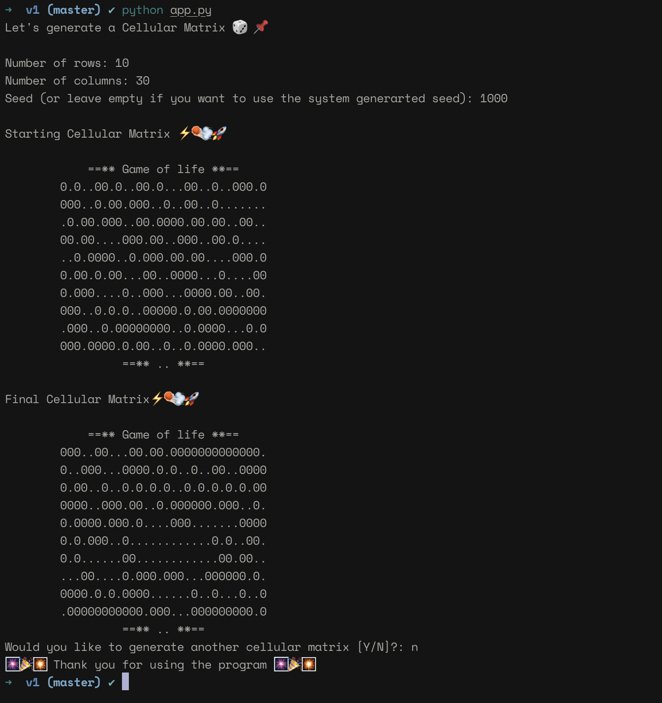

# A very basic Game of Life simulation



If you don't know about Conway's Game of Life, 
start by reading [this article](https://en.wikipedia.org/wiki/Conway%27s_Game_of_Life).

### Good articles / videos
1. Daniel Shiffman's [Coding Challenge #85](https://www.youtube.com/watch?v=FWSR_7kZuYg)
2. [How to write Conway's "Game of Life" in Python](https://medium.com/better-programming/how-to-write-conwells-game-of-life-in-python-c6eca19c4676)
3. [What are cellular Automata](https://www.youtube.com/watch?v=E7CxMHsYzSs) by [javidx9](https://community.onelonecoder.com/)


### Instructions

**Problem**

```console
You are tasked with creating a program capable of generating a random starting cellular matrix based
upon a given seed value. The program must then solve and print out the next 100 time-steps of a
modified game of life simulation. The simulation is guided by a handful of simplistic rules that will result
in a seemingly complex simulation of cellular organisms.

Below is an example starting cellular matrix when given an input of 10 rows and 20 columns:

	00.0.00....0000..000
	000..0.0.0.0000.0.0.
	00000...0000...0.0.0
	..0.00.0....0000..00
	.0.0..00....0....0..
	..00.00.00..0000....
	0....00..0.0...00..0
	.00..00.0..0...0.0.0
	.00.0.00..00....0000
	0.00..0......00.000.
```

**Direction**

```console
Develop a program capable of generating a random starting cellular matrix of a size directed by the user.
Your generator must abide by the following rules:
1) The starting matrix must only contain the following symbols:
a. Periods ‘.’ to signify currently “dead” cells.
b. Capital O’s to signify currently “alive” cells.
2) The starting matrix must be randomly generated making use of the seed value provided by the
user. As such:
a. Matrices generated using identical seeds should be identical.
b. Matrices generated using difference seeds should be different.

Using this starting cellular matrix, your program should then simulate the next 100 steps of a simulation
that uses the following rules to dictate what occurs during each time step:
1) Any position in the matrix with a period ‘.’ is considered “dead” during the current time step.
2) Any position in the matrix with a capital ‘O’ is considered “alive” during the current time step.
3) If an “alive” square has exactly two, three or four living neighbors, it continues to be “alive” in
the next time step.
4) If a “dead” square has an even number greater than 0 living neighbors, it will be “alive” in the
next time step.
5) Every other square dies or remains dead, causing it to be “dead” in the next time step.
```

##### Requirements
+ [Python](https://www.python.org/downloads/)

